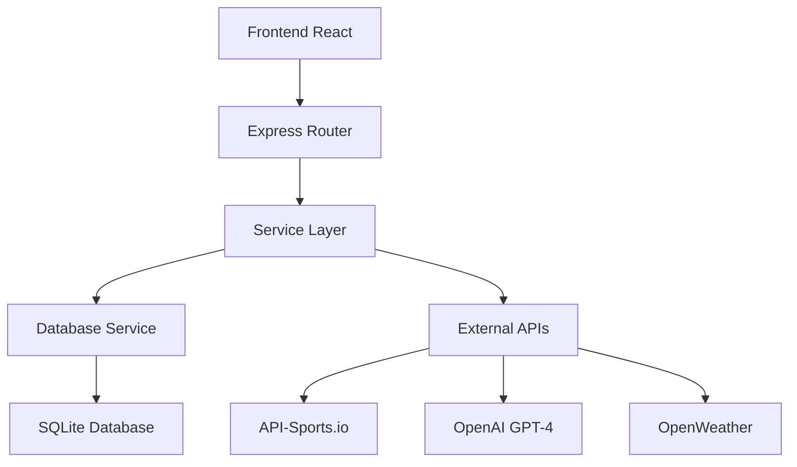

# 🔧 Dokumentacja Techniczna - Football Betting App

## 📋 Spis Treści
- [Architektura Techniczna](#architektura-techniczna)
- [Implementacja Kluczowych Funkcji](#implementacja-kluczowych-funkcji)
- [Integracje API](#integracje-api)
- [Baza Danych](#baza-danych)
- [Bezpieczeństwo](#bezpieczeństwo)
- [Wydajność](#wydajność)
- [Testowanie](#testowanie)
- [Deployment](#deployment)

---

## 🏗️ Architektura Techniczna

### 🎯 **Wzorce Architektoniczne**
- **MVC Pattern** - Model-View-Controller
- **Service Layer** - Logika biznesowa w serwisach
- **Repository Pattern** - Abstrakcja dostępu do danych
- **Factory Pattern** - Tworzenie instancji serwisów
- **Observer Pattern** - Reaktywne aktualizacje UI

### 🔄 **Przepływ Danych**


### 📦 **Struktura Modułów**
```
Backend Services:
├── footballDataService.js    # API Football integration
├── openaiAnalysisService.js  # AI analysis & predictions
├── databaseService.js        # Database operations
└── weatherService.js         # Weather data (optional)

Frontend Components:
├── App.jsx                   # Main app with tabs
├── MatchList.jsx            # Match listing
├── MatchAnalysis.jsx        # AI analysis display
├── ResultsAnalysis.jsx      # Results comparison
└── shared/                  # Reusable components
```

---

## ⚙️ Implementacja Kluczowych Funkcji

### 🎯 **1. Walidacja Składów**
```javascript
// src/services/openaiAnalysisService.js
hasConfirmedLineups(lineups) {
  if (!lineups || lineups.length === 0) return false;
  
  const homeLineup = lineups.find(l => l.team.id === lineups[0].team.id);
  const awayLineup = lineups.find(l => l.team.id !== lineups[0].team.id);
  
  if (!homeLineup || !awayLineup) return false;
  
  const homeHasPlayers = homeLineup.startXI && homeLineup.startXI.length >= 11;
  const awayHasPlayers = awayLineup.startXI && awayLineup.startXI.length >= 11;
  
  return homeHasPlayers && awayHasPlayers;
}

// Implementacja w saveAnalysisToDatabase
async saveAnalysisToDatabase(fixtureId, matchData, aiAnalysis, lineups = []) {
  const hasLineups = this.hasConfirmedLineups(lineups);
  
  if (!hasLineups) {
    console.log('⚠️ Składy nie są jeszcze potwierdzone - pomijam zapisywanie predykcji');
    return false;
  }
  
  // Zapisz predykcję tylko gdy składy są potwierdzone
  await databaseService.saveMatch(matchData);
  await databaseService.savePrediction(fixtureId, aiAnalysis);
  // ... reszta logiki
}
```

### 🧠 **2. System Cache z Czyszczeniem**
```javascript
// Cache management
class OpenAIAnalysisService {
  constructor() {
    this.analysisCache = new Map();
  }

  // Wyczyść cały cache
  clearCache() {
    const cacheSize = this.analysisCache.size;
    this.analysisCache.clear();
    console.log(`🧹 Wyczyszczono cache analiz (${cacheSize} elementów)`);
    return cacheSize;
  }

  // Wyczyść cache dla konkretnego meczu
  clearMatchCache(homeTeamId, awayTeamId) {
    const cacheKey = `${homeTeamId}_${awayTeamId}`;
    const deleted = this.analysisCache.delete(cacheKey);
    return deleted;
  }

  // Sprawdź cache przed analizą
  async analyzeMatch(homeTeam, awayTeam, ...) {
    const cacheKey = `${homeTeam.id}_${awayTeam.id}`;
    const now = Date.now();
    
    if (this.analysisCache.has(cacheKey)) {
      const cached = this.analysisCache.get(cacheKey);
      if (now - cached.timestamp < 600000) { // 10 minut
        return cached.data;
      }
      this.analysisCache.delete(cacheKey);
    }
    
    // Wykonaj nową analizę...
  }
}
```

### 📊 **3. Automatyczna Aktualizacja Wyników**
```javascript
// src/routes/bettingRoutes.js
router.post('/update-results', async (req, res) => {
  try {
    // Pobierz mecze z predykcjami
    const matchesWithPredictions = await databaseService.getMatchesWithPredictions();
    
    let updatedCount = 0;
    let errorCount = 0;
    const errors = [];
    
    for (const match of matchesWithPredictions) {
      try {
        // Pobierz aktualny status meczu z API
        const matchData = await footballDataService.getFixtureById(match.fixture_id);
        
        if (matchData && matchData.fixture.status.short === 'FT') {
          // Mecz się zakończył - zapisz wynik
          const saved = await databaseService.saveMatchResult(match.fixture_id, matchData);
          
          if (saved) {
            updatedCount++;
            console.log(`✅ Zaktualizowano wynik meczu ${match.fixture_id}`);
          }
        }
      } catch (error) {
        errorCount++;
        errors.push(`Błąd meczu ${match.fixture_id}: ${error.message}`);
      }
    }
    
    res.json({
      success: true,
      message: `Zaktualizowano ${updatedCount} wyników meczów`,
      data: { updatedCount, errorCount, errors }
    });
  } catch (error) {
    res.status(500).json({
      success: false,
      error: 'Błąd aktualizacji wyników'
    });
  }
});
```

### 🤖 **4. AI Meta-Analiza**
```javascript
// Analiza predykcji przez OpenAI
async analyzeWithCustomPrompt(prompt, maxTokens = 1000) {
  try {
    const openai = this.getOpenAI();
    
    if (!openai) {
      return 'Analiza AI niedostępna - brak klucza OpenAI';
    }

    const response = await openai.chat.completions.create({
      model: 'gpt-4',
      messages: [
        {
          role: 'system',
          content: 'Jesteś ekspertem od analizy predykcji sportowych. Analizujesz dokładność predykcji AI i dajesz konstruktywne uwagi.'
        },
        {
          role: 'user',
          content: prompt
        }
      ],
      max_tokens: maxTokens,
      temperature: 0.7
    });

    return response.choices[0].message.content;
  } catch (error) {
    console.error('Błąd analizy OpenAI:', error);
    throw error;
  }
}

// Użycie w komponencie ResultsAnalysis
const analyzeMatchWithAI = async (match) => {
  const analysisPrompt = `
Przeanalizuj dokładność predykcji AI dla meczu:
🏟️ MECZ: ${match.home_team_name} vs ${match.away_team_name}
🔮 PREDYKCJA: ${match.predicted_home_score}-${match.predicted_away_score}
⚽ WYNIK: ${match.actual_home_score}-${match.actual_away_score}
📊 DOKŁADNOŚĆ: ${match.result_correct ? 'TAK' : 'NIE'}

Zwróć analizę w formacie JSON z oceną, mocnymi stronami, słabościami i sugestiami.
`;
  
  const response = await fetch('/api/betting/openai/analyze', {
    method: 'POST',
    headers: { 'Content-Type': 'application/json' },
    body: JSON.stringify({ prompt: analysisPrompt })
  });
};
```

---

## 🔌 Integracje API

### ⚽ **API-Sports.io Integration**
```javascript
// src/services/footballDataService.js
class FootballDataService {
  constructor() {
    this.baseURL = 'https://v3.football.api-sports.io';
    this.headers = {
      'X-RapidAPI-Key': process.env.API_FOOTBALL_KEY,
      'X-RapidAPI-Host': 'v3.football.api-sports.io'
    };
    this.requestCount = 0;
    this.dailyLimit = 100; // Free tier limit
  }

  async makeRequest(endpoint, params = {}) {
    if (this.requestCount >= this.dailyLimit) {
      throw new Error('Daily API limit exceeded');
    }

    try {
      const url = new URL(endpoint, this.baseURL);
      Object.keys(params).forEach(key => 
        url.searchParams.append(key, params[key])
      );

      const response = await fetch(url, {
        headers: this.headers,
        timeout: 10000
      });

      this.requestCount++;
      
      if (!response.ok) {
        throw new Error(`API Error: ${response.status}`);
      }

      const data = await response.json();
      return data;
    } catch (error) {
      console.error('API Request failed:', error);
      throw error;
    }
  }

  // Główne metody API
  async getTodayFixtures() {
    const today = new Date().toISOString().split('T')[0];
    return this.makeRequest('/fixtures', {
      date: today,
      league: '39,140,78,135,61' // Top 5 leagues
    });
  }

  async getFixtureById(fixtureId) {
    return this.makeRequest('/fixtures', { id: fixtureId });
  }

  async getTeamForm(teamId, season = 2024) {
    return this.makeRequest('/fixtures', {
      team: teamId,
      season: season,
      last: 5
    });
  }

  async getLineups(fixtureId) {
    return this.makeRequest('/fixtures/lineups', { fixture: fixtureId });
  }
}
```

### 🤖 **OpenAI Integration**
```javascript
// src/services/openaiAnalysisService.js
class OpenAIAnalysisService {
  getOpenAI() {
    if (!this.openai) {
      const apiKey = process.env.OPENAI_API_KEY;
      if (!apiKey) {
        console.warn('OPENAI_API_KEY nie jest ustawiony - używam fallback analizy');
        return null;
      }
      this.openai = new OpenAI({ apiKey });
    }
    return this.openai;
  }

  async analyzeMatch(homeTeam, awayTeam, homeForm, awayForm, lineups, playerStats, teamPlayers, weather, fixtureId) {
    const openai = this.getOpenAI();
    
    if (!openai) {
      // Fallback analysis without OpenAI
      return this.getFallbackAnalysis(homeForm, awayForm, homeTeam.name, awayTeam.name);
    }

    const matchData = this.prepareMatchData(homeTeam, awayTeam, homeForm, awayForm, lineups, playerStats, teamPlayers, weather);
    
    const prompt = this.buildAnalysisPrompt(matchData);
    
    try {
      const response = await openai.chat.completions.create({
        model: 'gpt-4',
        messages: [
          {
            role: 'system',
            content: 'Jesteś ekspertem od analizy meczów piłkarskich. Analizujesz dane i przewidujesz wyniki.'
          },
          {
            role: 'user',
            content: prompt
          }
        ],
        max_tokens: 2000,
        temperature: 0.7
      });

      const analysis = JSON.parse(response.choices[0].message.content);
      
      // Zapisz do bazy jeśli składy są potwierdzone
      if (fixtureId && this.hasConfirmedLineups(lineups)) {
        await this.saveAnalysisToDatabase(fixtureId, matchData, analysis, lineups);
      }
      
      return analysis;
    } catch (error) {
      console.error('OpenAI Analysis failed:', error);
      return this.getFallbackAnalysis(homeForm, awayForm, homeTeam.name, awayTeam.name);
    }
  }
}
```

---

## 🗄️ Baza Danych

### 📊 **Schema Design**
```sql
-- Indeksy dla wydajności
CREATE INDEX idx_matches_fixture_id ON matches(fixture_id);
CREATE INDEX idx_matches_date ON matches(match_date);
CREATE INDEX idx_predictions_fixture_id ON match_predictions(fixture_id);
CREATE INDEX idx_results_fixture_id ON match_results(fixture_id);
CREATE INDEX idx_accuracy_fixture_id ON prediction_accuracy(fixture_id);

-- Triggery dla automatycznych aktualizacji
CREATE TRIGGER update_matches_timestamp 
AFTER UPDATE ON matches
BEGIN
  UPDATE matches SET updated_at = CURRENT_TIMESTAMP WHERE id = NEW.id;
END;

-- Widoki dla często używanych zapytań
CREATE VIEW match_predictions_with_results AS
SELECT 
  m.fixture_id,
  m.home_team_name,
  m.away_team_name,
  m.league_name,
  m.match_date,
  p.predicted_home_score,
  p.predicted_away_score,
  p.home_win_probability,
  p.draw_probability,
  p.away_win_probability,
  p.confidence_level,
  r.home_score as actual_home_score,
  r.away_score as actual_away_score,
  r.winner,
  a.result_correct,
  a.score_correct,
  a.probability_accuracy
FROM matches m
LEFT JOIN match_predictions p ON m.fixture_id = p.fixture_id
LEFT JOIN match_results r ON m.fixture_id = r.fixture_id
LEFT JOIN prediction_accuracy a ON m.fixture_id = a.fixture_id;
```

### 🔧 **Database Service Implementation**
```javascript
// src/services/databaseService.js
class DatabaseService {
  async initialize() {
    const dbDir = path.join(__dirname, '../../database');
    if (!fs.existsSync(dbDir)) {
      fs.mkdirSync(dbDir, { recursive: true });
    }

    this.db = await open({
      filename: path.join(dbDir, 'football_betting.db'),
      driver: sqlite3.Database
    });

    // Wykonaj schema
    const schemaPath = path.join(dbDir, 'schema.sql');
    if (fs.existsSync(schemaPath)) {
      const schema = fs.readFileSync(schemaPath, 'utf8');
      await this.db.exec(schema);
    }

    // Włącz foreign keys
    await this.db.exec('PRAGMA foreign_keys = ON');
    
    return this.db;
  }

  async saveMatch(matchData) {
    const { fixture, teams, league } = matchData;
    
    try {
      const result = await this.db.run(`
        INSERT OR REPLACE INTO matches (
          fixture_id, home_team_id, home_team_name, away_team_id, away_team_name,
          league_id, league_name, match_date, venue, status, updated_at
        ) VALUES (?, ?, ?, ?, ?, ?, ?, ?, ?, ?, CURRENT_TIMESTAMP)
      `, [
        fixture.id, teams.home.id, teams.home.name,
        teams.away.id, teams.away.name, league.id, league.name,
        fixture.date, fixture.venue?.name, fixture.status.short
      ]);

      console.log(`✅ Zapisano mecz: ${teams.home.name} vs ${teams.away.name}`);
      return result.lastID;
    } catch (error) {
      return this.handleError('zapisywania meczu', error);
    }
  }

  async savePrediction(fixtureId, aiAnalysis) {
    try {
      const result = await this.db.run(`
        INSERT OR REPLACE INTO match_predictions (
          fixture_id, home_win_probability, draw_probability, away_win_probability,
          predicted_home_score, predicted_away_score, confidence_level, ai_model
        ) VALUES (?, ?, ?, ?, ?, ?, ?, ?)
      `, [
        fixtureId,
        aiAnalysis.probabilities.homeWin,
        aiAnalysis.probabilities.draw,
        aiAnalysis.probabilities.awayWin,
        aiAnalysis.predictedScore.home,
        aiAnalysis.predictedScore.away,
        aiAnalysis.confidence,
        'GPT-4'
      ]);

      console.log(`✅ Zapisano predykcję dla meczu ${fixtureId}`);
      return result.lastID;
    } catch (error) {
      return this.handleError('zapisywania predykcji', error);
    }
  }

  async saveMatchResult(fixtureId, matchData) {
    try {
      // Zapisz wynik
      await this.db.run(`
        INSERT OR REPLACE INTO match_results (
          fixture_id, home_score, away_score, halftime_home_score, 
          halftime_away_score, winner
        ) VALUES (?, ?, ?, ?, ?, ?)
      `, [
        fixtureId,
        matchData.goals.home,
        matchData.goals.away,
        matchData.score.halftime.home,
        matchData.score.halftime.away,
        this.determineWinner(matchData.goals.home, matchData.goals.away)
      ]);

      // Oblicz dokładność
      await this.calculatePredictionAccuracy(fixtureId);
      
      console.log(`✅ Zapisano wynik meczu ${fixtureId}: ${matchData.goals.home}-${matchData.goals.away}`);
      return true;
    } catch (error) {
      return this.handleError('zapisywania wyniku meczu', error);
    }
  }

  async calculatePredictionAccuracy(fixtureId) {
    try {
      const prediction = await this.db.get(
        'SELECT * FROM match_predictions WHERE fixture_id = ?',
        [fixtureId]
      );
      
      const result = await this.db.get(
        'SELECT * FROM match_results WHERE fixture_id = ?',
        [fixtureId]
      );

      if (!prediction || !result) return false;

      const resultCorrect = this.isPredictionCorrect(prediction, result);
      const scoreCorrect = (
        prediction.predicted_home_score === result.home_score &&
        prediction.predicted_away_score === result.away_score
      );
      const totalGoalsCorrect = (
        (prediction.predicted_home_score + prediction.predicted_away_score) ===
        (result.home_score + result.away_score)
      );

      // Oblicz dokładność prawdopodobieństw
      const probabilityAccuracy = this.calculateProbabilityAccuracy(prediction, result);

      await this.db.run(`
        INSERT OR REPLACE INTO prediction_accuracy (
          fixture_id, result_correct, score_correct, total_goals_correct, probability_accuracy
        ) VALUES (?, ?, ?, ?, ?)
      `, [fixtureId, resultCorrect, scoreCorrect, totalGoalsCorrect, probabilityAccuracy]);

      console.log(`✅ Obliczono dokładność predykcji dla meczu ${fixtureId}`);
      return true;
    } catch (error) {
      return this.handleError('obliczania dokładności', error);
    }
  }
}
```

---

## 🔒 Bezpieczeństwo

### 🛡️ **API Security**
```javascript
// Rate limiting
const rateLimit = require('express-rate-limit');

const apiLimiter = rateLimit({
  windowMs: 15 * 60 * 1000, // 15 minut
  max: 100, // limit każdego IP do 100 zapytań na windowMs
  message: 'Zbyt wiele zapytań z tego IP, spróbuj ponownie później.'
});

app.use('/api/', apiLimiter);

// Input validation
const { body, validationResult } = require('express-validator');

router.post('/fixtures/:fixtureId/simulate-result',
  body('homeScore').isInt({ min: 0, max: 20 }),
  body('awayScore').isInt({ min: 0, max: 20 }),
  (req, res) => {
    const errors = validationResult(req);
    if (!errors.isEmpty()) {
      return res.status(400).json({
        success: false,
        errors: errors.array()
      });
    }
    // ... reszta logiki
  }
);

// Environment variables validation
function validateEnvironment() {
  const required = ['API_FOOTBALL_KEY'];
  const missing = required.filter(key => !process.env[key]);
  
  if (missing.length > 0) {
    console.error('❌ Brakujące zmienne środowiskowe:', missing);
    process.exit(1);
  }
}
```

### 🔐 **Database Security**
```javascript
// Prepared statements (już używane)
await this.db.run(
  'INSERT INTO matches (fixture_id, home_team_name) VALUES (?, ?)',
  [fixtureId, teamName]
);

// Error handling bez ujawniania szczegółów
handleError(operation, error) {
  console.error(`❌ Błąd podczas ${operation}:`, error);
  // Nie zwracamy szczegółów błędu do klienta
  return null;
}

// Backup strategy
async createBackup() {
  const timestamp = new Date().toISOString().replace(/[:.]/g, '-');
  const backupPath = `./database/backup_${timestamp}.db`;
  
  await fs.copyFile('./database/football_betting.db', backupPath);
  console.log(`✅ Backup utworzony: ${backupPath}`);
}
```

---

## ⚡ Wydajność

### 🚀 **Optymalizacje Backend**
```javascript
// Connection pooling dla SQLite
const sqlite3 = require('sqlite3').verbose();
const { open } = require('sqlite');

class DatabaseService {
  constructor() {
    this.connectionPool = [];
    this.maxConnections = 5;
  }

  async getConnection() {
    if (this.connectionPool.length > 0) {
      return this.connectionPool.pop();
    }
    
    return await open({
      filename: './database/football_betting.db',
      driver: sqlite3.Database
    });
  }

  async releaseConnection(connection) {
    if (this.connectionPool.length < this.maxConnections) {
      this.connectionPool.push(connection);
    } else {
      await connection.close();
    }
  }
}

// Caching strategy
class CacheManager {
  constructor() {
    this.cache = new Map();
    this.ttl = 10 * 60 * 1000; // 10 minut
  }

  set(key, value) {
    this.cache.set(key, {
      data: value,
      timestamp: Date.now()
    });
  }

  get(key) {
    const item = this.cache.get(key);
    if (!item) return null;
    
    if (Date.now() - item.timestamp > this.ttl) {
      this.cache.delete(key);
      return null;
    }
    
    return item.data;
  }

  clear() {
    this.cache.clear();
  }
}

// Batch operations
async saveBatchPredictions(predictions) {
  const stmt = await this.db.prepare(`
    INSERT OR REPLACE INTO match_predictions 
    (fixture_id, home_win_probability, draw_probability, away_win_probability,
     predicted_home_score, predicted_away_score, confidence_level, ai_model)
    VALUES (?, ?, ?, ?, ?, ?, ?, ?)
  `);

  try {
    await this.db.run('BEGIN TRANSACTION');
    
    for (const prediction of predictions) {
      await stmt.run([
        prediction.fixtureId,
        prediction.homeWin,
        prediction.draw,
        prediction.awayWin,
        prediction.predictedHome,
        prediction.predictedAway,
        prediction.confidence,
        'GPT-4'
      ]);
    }
    
    await this.db.run('COMMIT');
    await stmt.finalize();
    
    console.log(`✅ Zapisano ${predictions.length} predykcji w batch`);
  } catch (error) {
    await this.db.run('ROLLBACK');
    throw error;
  }
}
```

### 🎨 **Optymalizacje Frontend**
```javascript
// React.memo dla komponentów
const MatchCard = React.memo(({ match, onAnalyze }) => {
  return (
    <div className="match-card">
      <h3>{match.teams.home.name} vs {match.teams.away.name}</h3>
      <button onClick={() => onAnalyze(match.fixture.id)}>
        Analizuj
      </button>
    </div>
  );
});

// useMemo dla kosztownych obliczeń
const MatchList = () => {
  const [matches, setMatches] = useState([]);
  
  const filteredMatches = useMemo(() => {
    return matches.filter(match => 
      match.league.name.includes('Premier League') ||
      match.league.name.includes('La Liga')
    );
  }, [matches]);

  return (
    <div>
      {filteredMatches.map(match => (
        <MatchCard key={match.fixture.id} match={match} />
      ))}
    </div>
  );
};

// useCallback dla event handlerów
const ResultsAnalysis = () => {
  const [matches, setMatches] = useState([]);
  
  const analyzeMatch = useCallback(async (match) => {
    // ... logika analizy
  }, []);

  const fetchData = useCallback(async () => {
    // ... pobieranie danych
  }, []);

  return (
    <div>
      {matches.map(match => (
        <button key={match.id} onClick={() => analyzeMatch(match)}>
          Analizuj
        </button>
      ))}
    </div>
  );
};

// Lazy loading komponentów
const ResultsAnalysis = lazy(() => import('./components/ResultsAnalysis'));
const MatchAnalysis = lazy(() => import('./components/MatchAnalysis'));

function App() {
  return (
    <Suspense fallback={<div>Ładowanie...</div>}>
      <Routes>
        <Route path="/results" element={<ResultsAnalysis />} />
        <Route path="/analysis" element={<MatchAnalysis />} />
      </Routes>
    </Suspense>
  );
}
```

---

## 🧪 Testowanie

### 🔬 **Struktura Testów**
```javascript
// test-complete-system.js - Integration tests
async function testCompleteSystem() {
  console.log('🧪 KOMPLETNY TEST SYSTEMU');
  
  // Test serwerów
  await testServerAvailability();
  
  // Test endpointów
  await testAPIEndpoints();
  
  // Test bazy danych
  await testDatabaseOperations();
  
  // Test AI integration
  await testAIAnalysis();
  
  console.log('✅ Wszystkie testy przeszły pomyślnie');
}

// test-database-system.js - Database tests
async function testDatabaseSystem() {
  const testData = {
    fixture: { id: 999999, date: new Date().toISOString() },
    teams: { home: { id: 1, name: 'Test Home' }, away: { id: 2, name: 'Test Away' } },
    league: { id: 1, name: 'Test League' }
  };
  
  // Test zapisywania
  const saved = await databaseService.saveMatch(testData);
  assert(saved, 'Mecz powinien być zapisany');
  
  // Test pobierania
  const retrieved = await databaseService.db.get(
    'SELECT * FROM matches WHERE fixture_id = ?', 
    [999999]
  );
  assert(retrieved, 'Mecz powinien być pobrany');
  
  // Cleanup
  await databaseService.db.run('DELETE FROM matches WHERE fixture_id = ?', [999999]);
}

// test-openai-endpoint.js - AI tests
async function testOpenAIEndpoint() {
  const testPrompt = 'Przeanalizuj predykcję: Mecz A vs B, predykcja 1-0, wynik 2-1';
  
  const response = await axios.post('/api/betting/openai/analyze', {
    prompt: testPrompt,
    maxTokens: 200
  });
  
  assert(response.data.success, 'OpenAI endpoint powinien działać');
  assert(response.data.response.length > 0, 'Odpowiedź nie powinna być pusta');
}

// Unit tests dla serwisów
describe('FootballDataService', () => {
  let service;
  
  beforeEach(() => {
    service = new FootballDataService();
  });

  test('should fetch today fixtures', async () => {
    const fixtures = await service.getTodayFixtures();
    expect(fixtures).toBeDefined();
    expect(fixtures.data).toBeInstanceOf(Array);
  });

  test('should handle API errors gracefully', async () => {
    // Mock failed API call
    jest.spyOn(global, 'fetch').mockRejectedValue(new Error('API Error'));
    
    await expect(service.getTodayFixtures()).rejects.toThrow('API Error');
  });
});

describe('DatabaseService', () => {
  let service;
  
  beforeAll(async () => {
    service = new DatabaseService();
    await service.initialize();
  });

  afterAll(async () => {
    await service.close();
  });

  test('should save and retrieve match', async () => {
    const testMatch = {
      fixture: { id: 123, date: '2024-01-01' },
      teams: { home: { id: 1, name: 'Team A' }, away: { id: 2, name: 'Team B' } },
      league: { id: 1, name: 'Test League' }
    };

    const saved = await service.saveMatch(testMatch);
    expect(saved).toBeTruthy();

    const retrieved = await service.db.get(
      'SELECT * FROM matches WHERE fixture_id = ?', 
      [123]
    );
    expect(retrieved.home_team_name).toBe('Team A');
  });
});
```

### 📊 **Monitoring i Metryki**
```javascript
// Performance monitoring
class PerformanceMonitor {
  constructor() {
    this.metrics = new Map();
  }

  startTimer(operation) {
    this.metrics.set(operation, Date.now());
  }

  endTimer(operation) {
    const startTime = this.metrics.get(operation);
    if (startTime) {
      const duration = Date.now() - startTime;
      console.log(`⏱️ ${operation}: ${duration}ms`);
      this.metrics.delete(operation);
      return duration;
    }
  }

  async measureAsync(operation, asyncFunction) {
    this.startTimer(operation);
    try {
      const result = await asyncFunction();
      this.endTimer(operation);
      return result;
    } catch (error) {
      this.endTimer(operation);
      throw error;
    }
  }
}

// Usage
const monitor = new PerformanceMonitor();

const analysis = await monitor.measureAsync('AI Analysis', async () => {
  return await openaiAnalysisService.analyzeMatch(homeTeam, awayTeam, ...);
});

// Health check endpoint
router.get('/health', (req, res) => {
  const health = {
    status: 'OK',
    timestamp: new Date().toISOString(),
    uptime: process.uptime(),
    memory: process.memoryUsage(),
    database: databaseService.isConnected() ? 'Connected' : 'Disconnected',
    apiLimits: {
      football: footballDataService.requestCount,
      openai: openaiAnalysisService.requestCount
    }
  };
  
  res.json(health);
});
```

---

## 🚀 Deployment

### 🐳 **Docker Configuration**
```dockerfile
# Dockerfile
FROM node:18-alpine

WORKDIR /app

# Copy package files
COPY package*.json ./
RUN npm ci --only=production

# Copy source code
COPY . .

# Create database directory
RUN mkdir -p database

# Expose port
EXPOSE 3001

# Health check
HEALTHCHECK --interval=30s --timeout=3s --start-period=5s --retries=3 \
  CMD curl -f http://localhost:3001/api/betting/health || exit 1

# Start application
CMD ["node", "server.js"]
```

```yaml
# docker-compose.yml
version: '3.8'

services:
  football-betting-app:
    build: .
    ports:
      - "3001:3001"
    environment:
      - NODE_ENV=production
      - API_FOOTBALL_KEY=${API_FOOTBALL_KEY}
      - OPENAI_API_KEY=${OPENAI_API_KEY}
    volumes:
      - ./database:/app/database
      - ./logs:/app/logs
    restart: unless-stopped
    healthcheck:
      test: ["CMD", "curl", "-f", "http://localhost:3001/api/betting/health"]
      interval: 30s
      timeout: 10s
      retries: 3

  nginx:
    image: nginx:alpine
    ports:
      - "80:80"
      - "443:443"
    volumes:
      - ./nginx.conf:/etc/nginx/nginx.conf
      - ./ssl:/etc/nginx/ssl
    depends_on:
      - football-betting-app
    restart: unless-stopped
```

### 🔄 **CI/CD Pipeline**
```yaml
# .github/workflows/deploy.yml
name: Deploy Football Betting App

on:
  push:
    branches: [ main ]

jobs:
  test:
    runs-on: ubuntu-latest
    steps:
      - uses: actions/checkout@v3
      
      - name: Setup Node.js
        uses: actions/setup-node@v3
        with:
          node-version: '18'
          
      - name: Install dependencies
        run: npm ci
        
      - name: Run tests
        run: |
          npm run test:unit
          npm run test:integration
        env:
          API_FOOTBALL_KEY: ${{ secrets.API_FOOTBALL_KEY }}
          OPENAI_API_KEY: ${{ secrets.OPENAI_API_KEY }}

  deploy:
    needs: test
    runs-on: ubuntu-latest
    steps:
      - uses: actions/checkout@v3
      
      - name: Deploy to production
        run: |
          docker build -t football-betting-app .
          docker tag football-betting-app:latest registry.example.com/football-betting-app:latest
          docker push registry.example.com/football-betting-app:latest
```

### 📊 **Production Monitoring**
```javascript
// logger.js
const winston = require('winston');

const logger = winston.createLogger({
  level: 'info',
  format: winston.format.combine(
    winston.format.timestamp(),
    winston.format.errors({ stack: true }),
    winston.format.json()
  ),
  defaultMeta: { service: 'football-betting-app' },
  transports: [
    new winston.transports.File({ filename: 'logs/error.log', level: 'error' }),
    new winston.transports.File({ filename: 'logs/combined.log' }),
    new winston.transports.Console({
      format: winston.format.simple()
    })
  ]
});

// Metrics collection
const promClient = require('prom-client');

const httpRequestDuration = new promClient.Histogram({
  name: 'http_request_duration_seconds',
  help: 'Duration of HTTP requests in seconds',
  labelNames: ['method', 'route', 'status_code']
});

const databaseOperations = new promClient.Counter({
  name: 'database_operations_total',
  help: 'Total number of database operations',
  labelNames: ['operation', 'status']
});

// Middleware for metrics
app.use((req, res, next) => {
  const start = Date.now();
  
  res.on('finish', () => {
    const duration = (Date.now() - start) / 1000;
    httpRequestDuration
      .labels(req.method, req.route?.path || req.path, res.statusCode)
      .observe(duration);
  });
  
  next();
});
```

---

## 📈 Metryki i KPI

### 📊 **Kluczowe Wskaźniki**
- **Dokładność Predykcji**: % poprawnych przewidywań wyników
- **Dokładność Wyników**: % dokładnych wyników (exact score)
- **Czas Odpowiedzi API**: Średni czas odpowiedzi endpointów
- **Wykorzystanie Cache**: % zapytań obsłużonych z cache
- **Dostępność Systemu**: Uptime aplikacji
- **Błędy API**: Liczba błędów zewnętrznych API

### 🎯 **Cele Wydajnościowe**
- Czas odpowiedzi API: < 2s dla 95% zapytań
- Dostępność: > 99.5%
- Dokładność predykcji: > 60% (cel długoterminowy)
- Cache hit ratio: > 80%
- Błędy API: < 1% wszystkich zapytań

---

**Dokumentacja Techniczna v2.0**  
**Ostatnia aktualizacja**: 2025-01-08  
**Autor**: Kiro AI Assistant